# Art of Fitness

### Art of Fitness is a website designed to help everyone getting into fitenss. It explains some benefits of a fit life, workout tips as well as exercices, and dietary informations as well as some healthy meal examples.

### Open the webpage with this [live link](https://eddiestn.github.io/Art-of-fitness/index.html)

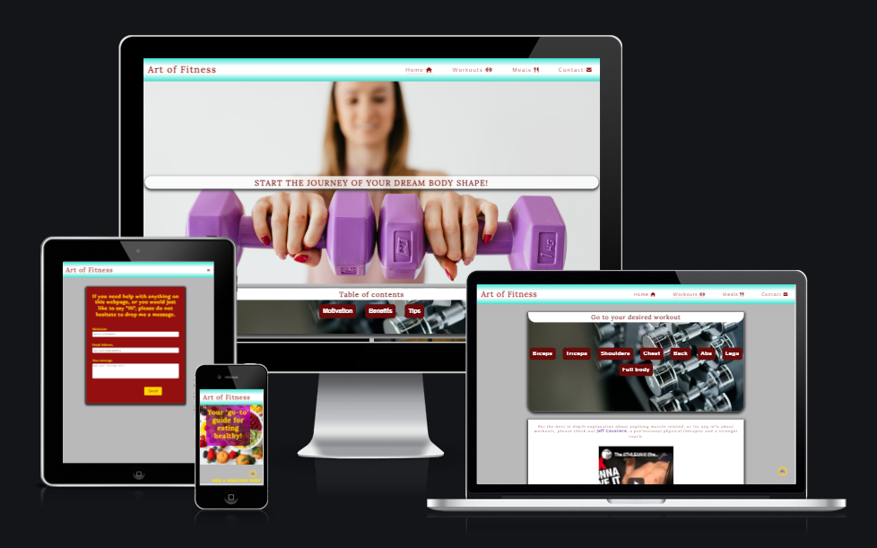

# Features

## Navigation bar 

- Available across all pages. 
- Includes links between pages, the Logo is also a link directing to home page.
- Turns into a drop-down hamburger menu for small screen sizes.

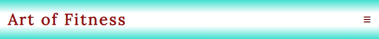

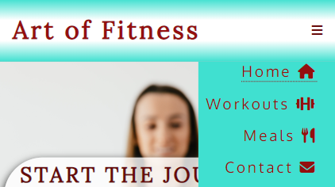

## Landing page

### As you open the website you are greeted by an encouraging phrase with a fitness photograph behind it, followed by the table of contents with redirecting links across the page

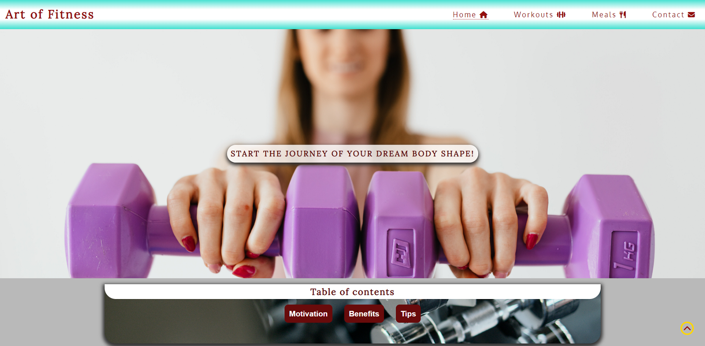

## Motivation section

### Boost your confidence with some famous motivational quotes and photos of athletic people.

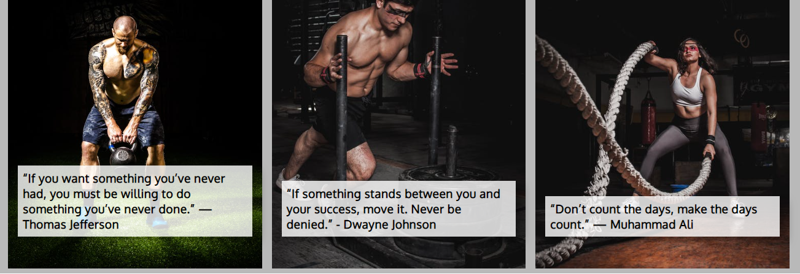

## Benefits of Fitness and Workout tips sections

### These 2 sections contain some benefits and tips and each category include expandable text giving more information on that specific subject.

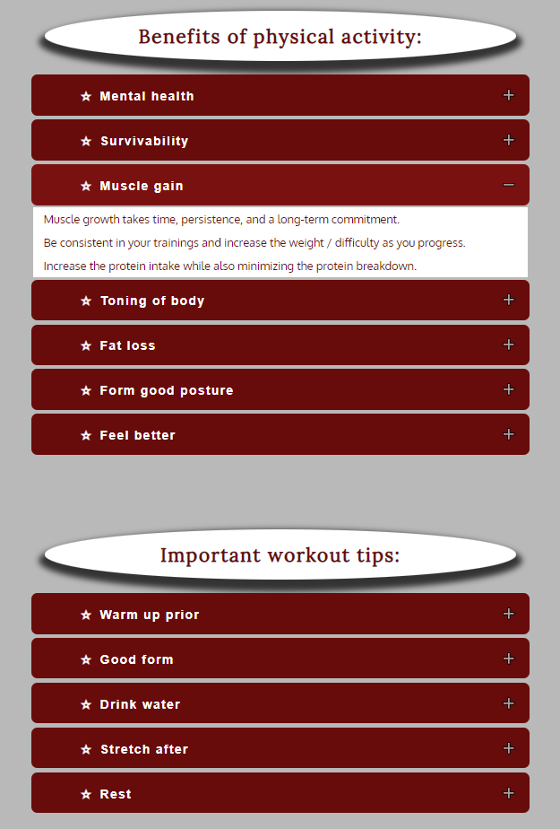

## Footer

### The footer contains links to other social media platforms and it is accesible across all pages.

## Workouts

### The workouts page contains perfect workouts for each individual body area as well as full-body, which are easily accesible from the top of the page, in the table of contents.

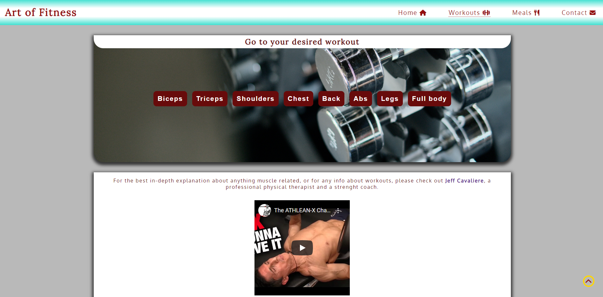

## Meals

### The meals page is a guide with nutritional knowledge, best times/things to eat around workouts and healthy meals for breakfast/lunch/dinner and snacks in between.

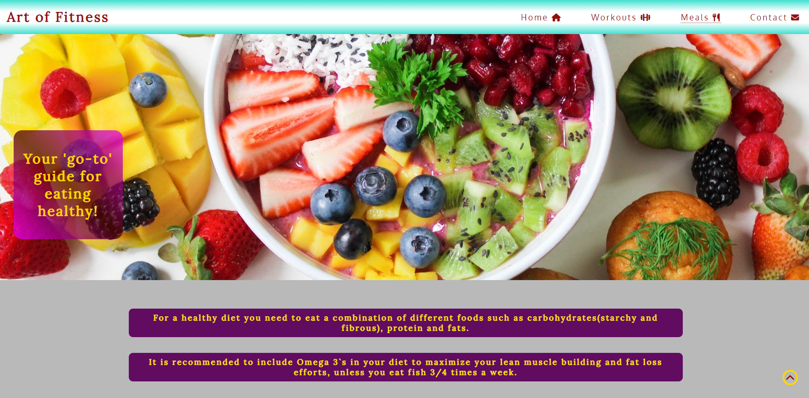
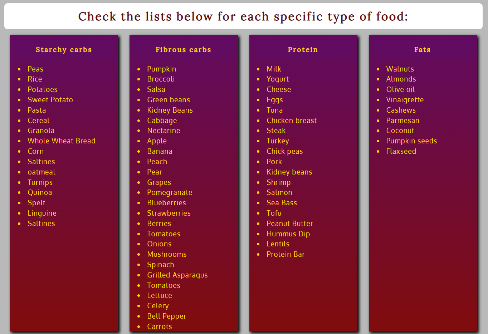
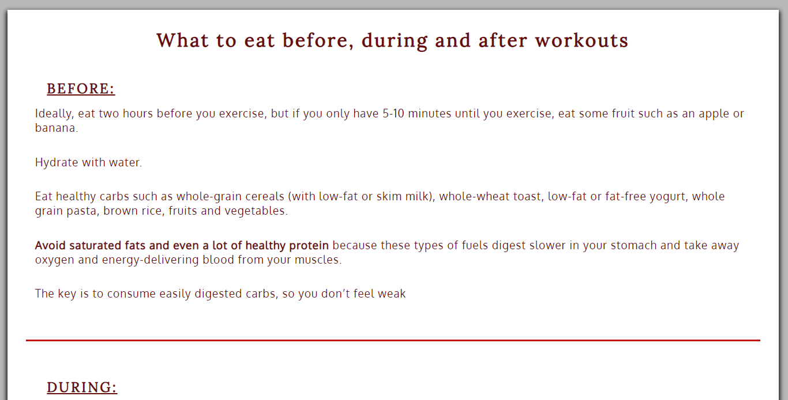
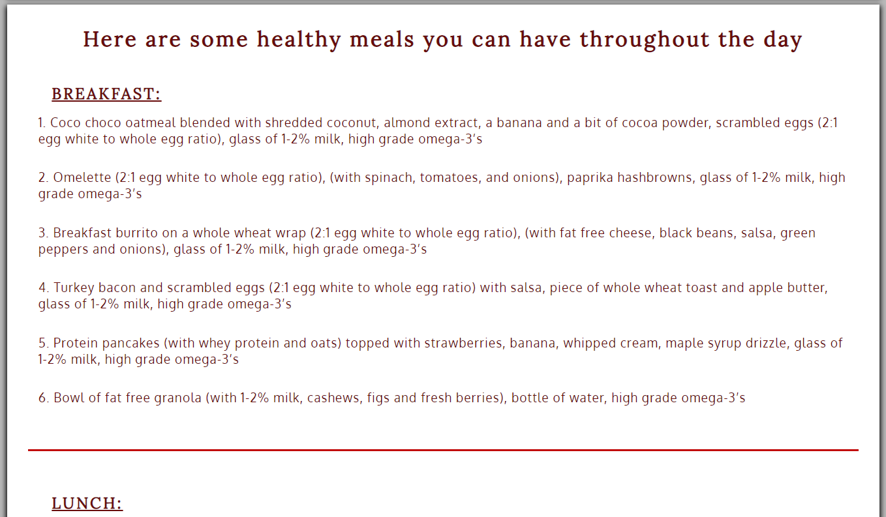

## Contact

### The contact page helps people to easily send a message in case they struggle anywhere or they need more information on any topic.

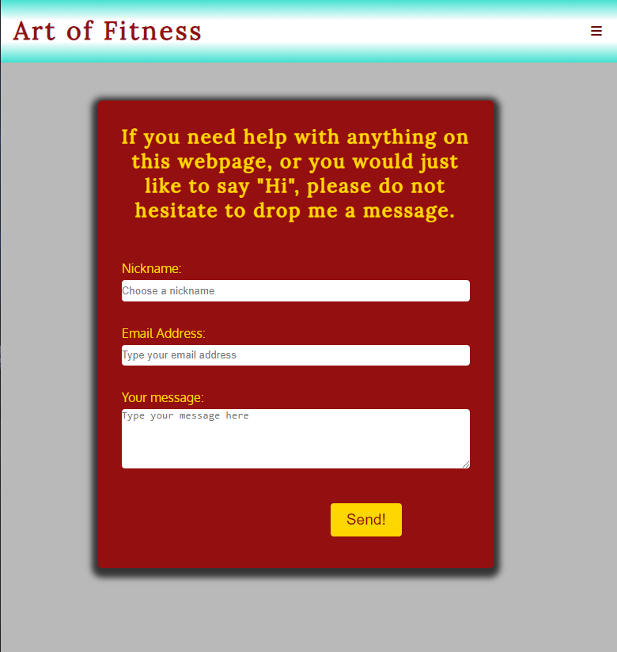

### The submit button takes you to a dummy "Thank you!" page

# Technologies used

## Languages 

- HTML
- CSS
- JavaScript 

## Frameworks and Libraries 

- [FontAwesome](https://fontawesome.com/)
- [pexels](https://www.pexels.com/)
- [Google fonts](https://fonts.google.com/)
- [Am I Responsive](https://ui.dev/amiresponsive)
- [GitPod](https://gitpod.io/)
- [GitHub](https://github.com/)

# Testing 

- I tested and confirmed that this page works in different browsers: Chrome, Firefox, Microsoft Edge, Safari.
- I tested and confirmed that the contact form works properly and the submit button is redirrecting you to a dummy "Thank you!" page.
- I confirmed that all hoverable and clickable elements work accordingly
- I confirmed that this project is responsive and functions on all screen sizes using chrome devtools.
 
## Validator testing

# Bugs 

### The project wasn`t responsive across all devices

- The solution and easier approach was using grid and flex css instead of floats
- Began mobile styling first and added media querries for bigger screens after
- Added hamburger menu for small screens to access other pages

### 

# Local development

## Forking

## Cloning

# Deployment 

### The site was deployed to GitHub pages. The steps to deploy are as follows:
- In the GitHub repository, navigate to the Settings tab
- From the source section drop-down menu, select the Master Branch
- Once the master branch has been selected, the page will be automatically refreshed with a detailed ribbon display to indicate the successful deployment.

The live link can be found here - https://eddiestn.github.io/Art-of-fitness/index.html

# Credits

## Content

- Fitess quotes - [Parade.com](https://parade.com/1045407/marynliles/fitness-quotes/)
- Nutrirional information and workouts- [Athleanx](https://athleanx.com/)
- Navbar styling inspired from Kevin Powell's [youtube video](https://www.youtube.com/watch?v=8QKOaTYvYUA&ab_channel=KevinPowell)
- Icons taken from [FontAwesome](https://fontawesome.com/)
- The JavaScript code for the collapsible section was taken from [w3schools](https://www.w3schools.com/howto/tryit.asp?filename=tryhow_js_collapsible)

## Media

- Youtube workout videos - [Athleanx](https://www.youtube.com/watch?v=zyvjscQVFv8&ab_channel=ATHLEAN-X%E2%84%A2)
- The pictures used on this website were taken from the open source website, [pexels](https://www.pexels.com/)

# Aknowledgements

### Many thanks for their brilliant teachings to:

- [w3schools](https://www.w3schools.com/howto/tryit.asp?filename=tryhow_js_collapsible) (collapsible)
- [Kevin Powell](https://www.youtube.com/kepowob) (grid and flex css layout)
- [Code Institute](https://learn.codeinstitute.net/) (general)

# Sources

### Sites and courses that provided me with extra information and best practices to help build this project

- [Code with Mosh](https://codewithmosh.com/)
- [Mimo](https://getmimo.com/)
- [Code Institute](https://learn.codeinstitute.net/)
- https://learncssgrid.com/
- https://cssgridgarden.com/
- [Slack](https://slack.com/intl/en-gb/)

