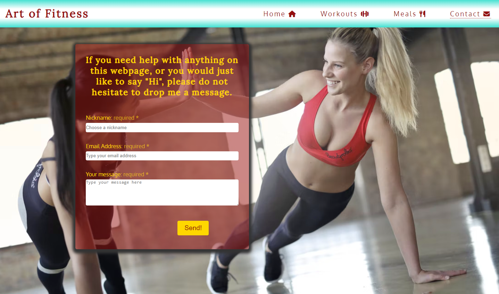

# Art of Fitness

### Art of Fitness is a website designed to help everyone getting into fitenss. It explains some benefits of a fit life, workout tips as well as exercices, and dietary informations as well as some healthy meal examples.

### Open the live webpage through this [link](https://eddiestn.github.io/Art-of-fitness/index.html)

 

# Features

## Navigation bar 

- Available across all pages. 
- Includes links between pages, the Logo is also a link directing to home page.
- Turns into a drop-down hamburger menu for small screen sizes.

## Landing page

### As you open the website you are greeted by an encouraging phrase with a fitness photograph behind it, followed by the table of contents with redirecting links across the page

## Motivation section

### Boost your confidence with some famous motivational quotes and photos of athletic people.

## Benefits of Fitness and Workout tips sections

### These 2 sections contain some benefits and tips and each category include expandable text giving more information on that specific subject.

## Footer

### The footer contains links to other social media platforms and it is accesible across all pages.

## Workouts

### The workouts page contains perfect workouts for each individual body area as well as full-body, which are easily accesible from the top of the page, in the table of contents.

## Meals

### The meals page is a guide with nutritional knowledge, best times/things to eat around workouts and healthy meals for breakfast/lunch/dinner and snacks in between.

## Contact

### The contact page allows people to easily send a message in case they struggle anywhere or they need more information on any topic.

### The submit button takes you to a "Thank you!" page, however, this being just for testing, the message is not sent.

# Technologies used

## Languages 

- HTML
- CSS
- JavaScript 

## Frameworks and Libraries 

- [FontAwesome](https://fontawesome.com/)
- [Google fonts](https://fonts.google.com/)
- [Am I Responsive](https://ui.dev/amiresponsive)
- [GitPod](https://gitpod.io/)
- [GitHub](https://github.com/)
- [Image compressor](https://imagecompressor.com/)

# Testing 

- I tested and confirmed that this page works in different browsers: Chrome, Firefox, Microsoft Edge, Safari.

- I tested and confirmed that the contact form works properly and the submit button is redirrecting you to a dummy "Thank you!" page.
- I confirm that all hoverable and clickable elements work accordingly
- I confirm that this project is responsive and functions on all screen sizes, used chrome and firefox devtools for testing. 

<!-- <video src="assets/videos/responsive.mp4" width="500" autoplay muted loop controls="1"> -->

## Validator testing

### HTML 

- No errors were returned when passing through the official W3C validator
    * https://validator.w3.org/nu/?doc=https%3A%2F%2Feddiestn.github.io%2FArt-of-fitness%2Findex.html
    * https://validator.w3.org/nu/?doc=https%3A%2F%2Feddiestn.github.io%2FArt-of-fitness%2Fworkouts.html
    * https://validator.w3.org/nu/?doc=https%3A%2F%2Feddiestn.github.io%2FArt-of-fitness%2Fmeals.html
    * https://validator.w3.org/nu/?doc=https%3A%2F%2Feddiestn.github.io%2FArt-of-fitness%2Fcontact.html
    * https://validator.w3.org/nu/?doc=https%3A%2F%2Feddiestn.github.io%2FArt-of-fitness%2Fthanks.html

### CSS W3C Validator - JIGSAW

- No errors were found when passing through the official (Jigsaw) validator
    * https://jigsaw.w3.org/css-validator/validator?uri=https%3A%2F%2Feddiestn.github.io%2FArt-of-fitness%2Findex.html&profile=css3svg&usermedium=all&warning=1&vextwarning=&lang=en#css

# Bugs 

### The project wasn`t responsive across all devices

- The solution and easier approach was using grid and flex css instead of floats
- Began mobile styling first and added media querries for bigger screens after
- Added hamburger menu for small screens to access other pages

# Local development

## Forking and Cloning

## Forking a repository
### A fork is a copy of a repository. Forking a repository allows you to freely experiment with changes without affecting the original project.

1. On GitHub.com, navigate to the EddieStn/Art-of-fitness repository.
2. In the top-right corner of the page, click **Fork**.

## Cloning your forked repository
### Right now, you have a fork of the Art-of-fitness repository, but you do not have the files in that repository locally on your computer.

1. On GitHub.com, navigate to your fork of the Art-of-fitness repository.
2. Above the list of files, click  **Code**.
3. Copy the URL for the repository.
4. Open Git Bash.
5. Change the current working directory to the location where you want the cloned directory.
6. Type git clone, and then paste the URL you copied earlier. It will look like this, with your GitHub username instead of YOUR-USERNAME:
    * `$ git clone https://github.com/YOUR-USERNAME/Art-of-fitness`
7. Press Enter. Your local clone will be created.

# Deployment 

### The site was deployed to GitHub pages. The steps to deploy are as follows:
- In the GitHub repository, navigate to the Settings tab
- From the source section drop-down menu, select the Master Branch
- Once the master branch has been selected, the page will be automatically refreshed with a detailed ribbon display to indicate the successful deployment.

The live link can be found here - https://eddiestn.github.io/Art-of-fitness/index.html

# Credits

## Content

- Fitess quotes - [Parade.com](https://parade.com/1045407/marynliles/fitness-quotes/)
- Nutrirional information and workouts- [Athleanx](https://athleanx.com/)
- Navbar styling inspired from Kevin Powell's [youtube video](https://www.youtube.com/watch?v=8QKOaTYvYUA&ab_channel=KevinPowell)
- Icons taken from [FontAwesome](https://fontawesome.com/)
- The JavaScript code for the collapsible section was taken from [w3schools](https://www.w3schools.com/howto/tryit.asp?filename=tryhow_js_collapsible)

## Media

- Youtube workout videos - [Athleanx](https://www.youtube.com/watch?v=zyvjscQVFv8&ab_channel=ATHLEAN-X%E2%84%A2)
- The pictures used on this website were taken from the open source websites: [pexels](https://www.pexels.com/), [unsplash](https://unsplash.com/) (add links note)

    * Contact / Thank you page background - https://www.pexels.com/photo/women-exercising-866027/
    * Landing Hero - https://www.pexels.com/photo/purple-dumbbells-in-hands-of-positive-sportswoman-4498294/
    * Meals Hero - https://www.pexels.com/photo/assorted-sliced-fruits-in-white-ceramic-bowl-1092730/
    * Workouts table background - https://www.pexels.com/photo/man-holding-barbell-1431282/
    * Motivation Quote 1 - https://www.pexels.com/photo/man-in-blue-shorts-carrying-brown-exercise-equipments-116079/
    * Motivation Quote 2 - https://www.pexels.com/photo/man-pushing-steel-frame-with-pile-of-weight-plates-1552102/
    * Motivation Quote 3 - https://www.pexels.com/photo/woman-holding-rope-1552108/
    * Motivation Quote 4 - https://www.pexels.com/photo/woman-doing-sit-ups-3076516/
    * Motivation Quote 5 - https://www.pexels.com/photo/man-holding-dumbbell-3289711/
    * Motivation Quote 6 - https://unsplash.com/photos/sHfo3WOgGTU
    * Motivation Quote 7 - https://unsplash.com/photos/Y1drF0Y3Oe0
    * Motivation Quote 8 - https://unsplash.com/photos/FbP1IvjV2ns
    * Motivation Quote 9 - https://unsplash.com/photos/Kl2t5U6Gkm0

# Aknowledgements

### Many thanks for their brilliant teachings to:

- [Kevin Powell](https://www.youtube.com/kepowob) (grid and flex css layout)
- [Code Institute](https://learn.codeinstitute.net/) (general)

## I would also like to thank my mentor, Chris Quinn, for his guidance! 

# Sources

### Sites and courses that provided me with extra information and best practices to help build this project

- [Code with Mosh](https://codewithmosh.com/)
- [Mimo](https://getmimo.com/)
- [Code Institute](https://learn.codeinstitute.net/)
- https://learncssgrid.com/
- https://cssgridgarden.com/
- [Kevin Powell](https://www.youtube.com/kepowob)
- [w3schools](https://www.w3schools.com/howto/tryit.asp?filename=tryhow_js_collapsible)
- [Slack](https://slack.com/intl/en-gb/)

